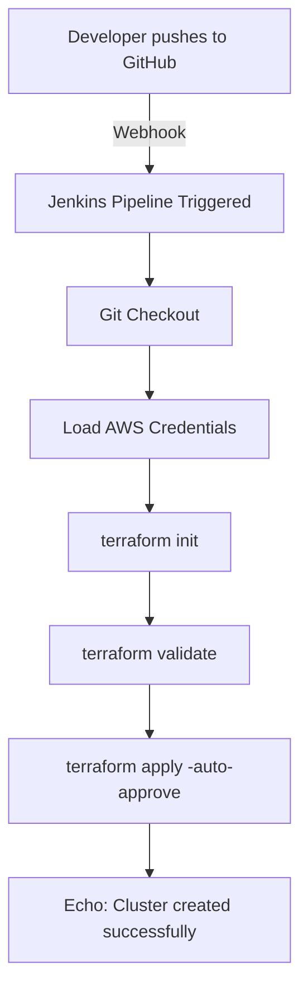
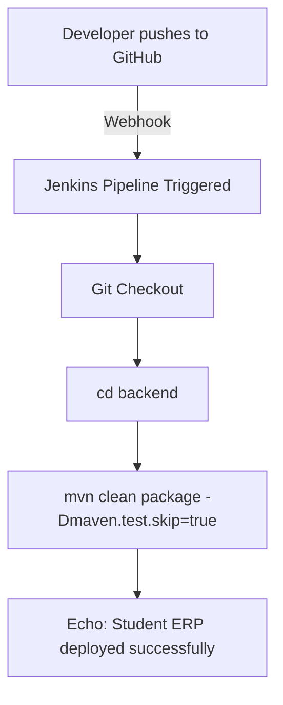

# 1) Jenkins + SonarQube Setup and Pipeline

This guide explains how to integrate **Jenkins** with **SonarQube** for code analysis using EC2 instances.

## 1. Create EC2 Instances
- **Instance 1:** Jenkins (instance type : t2.medium or more) 
- **Instance 2:** SonarQube  (instance type : t2.medium or more)

## 2. Setup Jenkins EC2 Server

### Install Java 17
```bash
sudo apt install openjdk-17-jdk -y
```

### Install Jenkins

Follow official Jenkins documentation:
👉 [Jenkins Installation Guide](https://www.jenkins.io/doc/book/installing/linux/)

### Install Maven
```bash
sudo apt install maven -y
```

## 3. Setup SonarQube EC2 Server
### Install Docker
```bash
sudo apt install docker.io -y
```
### Run SonarQube
```bash
docker run -d --name sonarqube-custom -p 9000:9000 sonarqube:10.6-community
```

## 4. Access Jenkins & SonarQube
- Jenkins: `http://<jenkins-public-ip>:8080`
- SonarQube: `http://<sonarqube-public-ip>:9000`
    - Login SonarQube with:
        - Username: `admin`
        - Password: `admin`
        - Change the default password after first login.


## 5. Configure SonarQube

1. Create Webhook
    - Go to: **Administration** → **Configuration** → **Webhooks** → **Create**
    - Name: `Sonar-webhook`
    - URL: `http://<jenkins-public-ip>:8080/sonarqube-webhook/`
2. Create a Project
    - Go to **Projects** → **Create Project** → **Local Project*
    - Project display Name: `studentapp`
    - Project key: `studentapp`
    - Main branch name: `main` then click **Next**
    - Select **Use global settings**
    - Generate **token** → **Copy** & save it
    - Select **Maven** as build tool → Copy the given command

## 6. Configure Jenkins
### 1. Install Plugin
  - Dashboard → Manage Jenkins → Plugins → Available Plugins
  - Install: **SonarQube Scanner for Jenkins**
### 2. Add Credentials
  - Dashboard → Manage Jenkins → Credentials → Global credentials (unrestricted)
  - Add new credential:
      - Kind: `Secret Text`
      - Secret: `<SonarQube Token>`
      - ID: `sonar-token`
### 3. Configure SonarQube Server
  - Dashboard → Manage Jenkins → System
  - Find SonarQube Server section
  - Enable environment variable
  - Add new SonarQube:
      - Name: `Sonar-env`
      - Server URL: `http://<sonarqube-public-ip>:9000`
      - Authentication Token: `sonar-token`
  - Save changes
**Note (optional)**: After configuring, restart the Jenkins server to ensure it operates smoothly. (http://<jenkins-public-ip>:8080/restart)

### Update the pom.xml with sonarqube dependancy

## 7. Create Jenkins Pipeline
1. Go to Dashboard → New Item → Pipeline
2. Paste the following pipeline code:
```jdp
pipeline {
    agent any
    stages {
        stage('pull') {
            steps {
                git branch: 'main', url: 'https://github.com/Rohit-1920/EasyCRUD-Updated.git'
            }
        }
        stage('build') {
            steps {
                sh '''cd backend
                    mvn clean package -DskipTests'''
            }
        }
        stage('test') {
            steps {
                withSonarQubeEnv(credentialsId: 'sonar-token', installationName: 'Sonar-env'){
                    sh '''cd backend
                        mvn org.sonarsource.scanner.maven:sonar-maven-plugin:sonar \\
                        -Dsonar.projectKey=studentapp \\
                        -Dsonar.projectName=studentapp'''
                }
            }
        }
        
        stage('Quality Gate') {
            steps {
                timeout(time: 10, unit: 'MINUTES') {
                    waitForQualityGate abortPipeline: true, credentialsId: 'sonar-token'
                }
            }
        }
    }
}
```

## 8. Run the Pipeline
- Build the job in Jenkins.
- Check results in SonarQube Dashboard.

## ✅ Summary
- Jenkins → CI/CD automation
- SonarQube → Code quality & security analysis
- Integration ensures code passes quality checks before deployment.


--------------------------------------------------------------------------------------------------------------------------------------
# 2) ⚙️ Jenkins Pipeline Projects

Two Jenkins pipeline setups documented step-by-step:
1. 🏗️ Create a cluster using **Terraform**
2. 🎓 Host **Student ERP** application

---

## 🏗️ How to Create a Cluster in Jenkins Using Terraform

### Step 1 — Prepare the EC2 instance
- Launch an **EC2 instance** (type: `c7i`)
- Install the following tools on it:
  - ✅ AWS CLI
  - ✅ Terraform
  - ✅ Jenkins
- Run `aws configure` to connect AWS CLI with your AWS account

### Step 2 — Configure Jenkins for AWS access
- Log in to **Jenkins**
- Go to **Manage Jenkins → Plugins → Available Plugins**
- Search for **AWS Credentials** plugin → Install it
- Go to **Manage Jenkins → Credentials**
- Add a new credential → Type: **AWS Access Key** → enter your **Access Key ID** and **Secret Access Key**

### Step 3 — Connect GitHub repo with Webhook
- Go to your **GitHub repository → Settings → Webhooks → Add webhook**
- Payload URL:
  ```
  http://<jenkins-server-ip>:8080/github-webhook/
  ```
- Click **Add webhook** ✅

### Step 4 — Create the Jenkins Pipeline Job
- **New Item → Pipeline**
- Under **Build Triggers**, enable ✅ **GitHub hook trigger for GITScm polling**
- In the **Pipeline script** box, search Google for **"Jenkins Declarative Pipeline"** and paste the base template as a starting point

### Step 5 — Build the script using Pipeline Syntax generator
Click **Pipeline Syntax** (at the bottom of the job config page), and generate each block below one at a time — copy each result into your script:

| Order | Select in Pipeline Syntax | Purpose |
|-------|---------------------------|---------|
| 1 | `git` | Clone the repository — fill in repo URL + branch |
| 2 | `withCredentials` | Securely load your AWS credentials into the pipeline |
| 3 | `sh` (shell) | Run: `terraform init` |
| 4 | `sh` (shell) | Run: `terraform validate` |
| 5 | `sh` (shell) | Run: `terraform apply -auto-approve` |
| 6 | `sh` (shell) | Run: `echo "Cluster created successfully"` |

### Step 6 — Save and Build
- Click **Save**
- Click **Build Now** 🚀

### 🖼️ Pipeline Flow



---

## 🎓 How to Host Student ERP on Jenkins

### Step 1 — Create the Jenkins Pipeline Job
- **New Item → Pipeline**
- Under **Build Triggers**, enable ✅ **GitHub hook trigger for GITScm polling**
- Search Google for **"Jenkins Declarative Pipeline"** and paste the base template into the script box

### Step 2 — Build the script using Pipeline Syntax generator
Click **Pipeline Syntax**, generate each block, and copy the result into your script:

| Order | Select in Pipeline Syntax | Purpose |
|-------|---------------------------|---------|
| 1 | `git` | Clone the repository — fill in repo URL + branch |
| 2 | `sh` (shell) | Move into backend folder and build: `cd backend` then `mvn clean package -Dmaven.test.skip=true` |
| 3 | `sh` (shell) | Run: `echo "Student ERP deployed successfully"` |

### Step 3 — Save and Build
- Click **Save**
- Click **Build Now** 🚀

### 🖼️ Pipeline Flow



---

## 📌 Notes

- Both pipelines are triggered automatically via a **GitHub webhook** whenever code is pushed
- The **Pipeline Syntax generator** in Jenkins is used to auto-generate correct script blocks instead of writing them manually — reduces syntax errors
- `withCredentials` is used specifically when secrets (like AWS keys) are needed inside the pipeline — it keeps them out of plain text
- **Build Now** can always be used to manually re-trigger a pipeline, in addition to the webhook auto-trigger

3) 📦 Copy Artifact File to S3 Using Jenkins

💡 What is an Artifact?

An artifact is a snapshot of a running application — a packaged, ready-to-run build. Once created, you don't need to rebuild the app again; the same artifact can be deployed to any other server directly.


🧩 Required Plugins


✅ S3 Publisher
✅ Pipeline: AWS Steps
✅ AWS Credentials


🔧 Setup Steps

Step 1 — Prepare infrastructure


Create an S3 bucket
Launch an EC2 instance (type: c7i)
Install on the instance:

✅ Jenkins
✅ Maven
✅ Java (versions 17 and 21)


Step 2 — Install & configure Jenkins plugins


Go to Manage Jenkins → Plugins → Available Plugins
Install:

S3 Publisher
Pipeline: AWS Steps
AWS Credentials


Go to Manage Jenkins → Credentials → add your AWS Access Key + Secret Key
Restart Jenkins so the plugins load correctly


Step 3 — Create the pipeline job


New Item → Pipeline
In the Pipeline script box, paste the script below
⚠️ Update:

bucket → your actual S3 bucket name
credentialsId → the exact name you gave your credentials in Jenkins


groovypipeline {
    agent any
    stages {
        stage('pull') {
            steps {
                git branch: 'main', url: 'https://github.com/Rohit-1920/EasyCRUD-Updated.git'
            }
        }
        stage('build') {
            steps {
                sh '''cd backend
                mvn clean package -DskipTests'''
            }
        }
        stage('s3Upload') {
            steps {
                withCredentials([aws(accessKeyVariable: 'AWS_ACCESS_KEY_ID', credentialsId: 'aws-cred', secretKeyVariable: 'AWS_SECRET_ACCESS_KEY')]) {
                    s3Upload acl: 'Private', bucket: 'jenkins-artifact-manager123', file: 'backend/target/student-registration-backend-0.0.1-SNAPSHOT.jar', path: ''
                }
            }
        }
    }
}

Step 4 — Build


Click Save
Click Build Now 🚀


🖼️ Pipeline Flow

#mermaid-r7q5-r13 { font-family: "Anthropic Sans", system-ui, "Segoe UI", Roboto, Helvetica, Arial, sans-serif; font-size: 16px; fill: rgb(229, 229, 229); }
#mermaid-r7q5-r13 .edge-animation-slow { stroke-dashoffset: 900; animation: 50s linear 0s infinite normal none running dash; stroke-linecap: round; stroke-dasharray: 9, 5 !important; }
#mermaid-r7q5-r13 .edge-animation-fast { stroke-dashoffset: 900; animation: 20s linear 0s infinite normal none running dash; stroke-linecap: round; stroke-dasharray: 9, 5 !important; }
#mermaid-r7q5-r13 .error-icon { fill: rgb(204, 120, 92); }
#mermaid-r7q5-r13 .error-text { fill: rgb(51, 135, 163); stroke: rgb(51, 135, 163); }
#mermaid-r7q5-r13 .edge-thickness-normal { stroke-width: 1px; }
#mermaid-r7q5-r13 .edge-thickness-thick { stroke-width: 3.5px; }
#mermaid-r7q5-r13 .edge-pattern-solid { stroke-dasharray: 0; }
#mermaid-r7q5-r13 .edge-thickness-invisible { stroke-width: 0; fill: none; }
#mermaid-r7q5-r13 .edge-pattern-dashed { stroke-dasharray: 3; }
#mermaid-r7q5-r13 .edge-pattern-dotted { stroke-dasharray: 2; }
#mermaid-r7q5-r13 .marker { fill: rgb(161, 161, 161); stroke: rgb(161, 161, 161); }
#mermaid-r7q5-r13 .marker.cross { stroke: rgb(161, 161, 161); }
#mermaid-r7q5-r13 svg { font-family: "Anthropic Sans", system-ui, "Segoe UI", Roboto, Helvetica, Arial, sans-serif; font-size: 16px; }
#mermaid-r7q5-r13 p { margin: 0px; }
#mermaid-r7q5-r13 .label { font-family: "Anthropic Sans", system-ui, "Segoe UI", Roboto, Helvetica, Arial, sans-serif; color: rgb(229, 229, 229); }
#mermaid-r7q5-r13 .cluster-label text { fill: rgb(51, 135, 163); }
#mermaid-r7q5-r13 .cluster-label span { color: rgb(51, 135, 163); }
#mermaid-r7q5-r13 .cluster-label span p { background-color: transparent; }
#mermaid-r7q5-r13 .label text, #mermaid-r7q5-r13 span { fill: rgb(229, 229, 229); color: rgb(229, 229, 229); }
#mermaid-r7q5-r13 .node rect, #mermaid-r7q5-r13 .node circle, #mermaid-r7q5-r13 .node ellipse, #mermaid-r7q5-r13 .node polygon, #mermaid-r7q5-r13 .node path { fill: transparent; stroke: rgb(161, 161, 161); stroke-width: 1px; }
#mermaid-r7q5-r13 .rough-node .label text, #mermaid-r7q5-r13 .node .label text, #mermaid-r7q5-r13 .image-shape .label, #mermaid-r7q5-r13 .icon-shape .label { text-anchor: middle; }
#mermaid-r7q5-r13 .node .katex path { fill: rgb(0, 0, 0); stroke: rgb(0, 0, 0); stroke-width: 1px; }
#mermaid-r7q5-r13 .rough-node .label, #mermaid-r7q5-r13 .node .label, #mermaid-r7q5-r13 .image-shape .label, #mermaid-r7q5-r13 .icon-shape .label { text-align: center; }
#mermaid-r7q5-r13 .node.clickable { cursor: pointer; }
#mermaid-r7q5-r13 .root .anchor path { stroke-width: 0; stroke: rgb(161, 161, 161); fill: rgb(161, 161, 161) !important; }
#mermaid-r7q5-r13 .arrowheadPath { fill: rgb(11, 11, 11); }
#mermaid-r7q5-r13 .edgePath .path { stroke: rgb(161, 161, 161); stroke-width: 1px; }
#mermaid-r7q5-r13 .flowchart-link { stroke: rgb(161, 161, 161); fill: none; }
#mermaid-r7q5-r13 .edgeLabel { background-color: transparent; text-align: center; }
#mermaid-r7q5-r13 .edgeLabel p { background-color: transparent; }
#mermaid-r7q5-r13 .edgeLabel rect { opacity: 0.5; background-color: transparent; fill: transparent; }
#mermaid-r7q5-r13 .labelBkg { background-color: rgba(0, 0, 0, 0.5); }
#mermaid-r7q5-r13 .cluster rect { fill: rgb(204, 120, 92); stroke: rgb(138, 115, 107); stroke-width: 1px; }
#mermaid-r7q5-r13 .cluster text { fill: rgb(51, 135, 163); }
#mermaid-r7q5-r13 .cluster span { color: rgb(51, 135, 163); }
#mermaid-r7q5-r13 div.mermaidTooltip { position: absolute; text-align: center; max-width: 200px; padding: 2px; font-family: "Anthropic Sans", system-ui, "Segoe UI", Roboto, Helvetica, Arial, sans-serif; font-size: 12px; background: rgb(204, 120, 92); border: 1px solid rgb(138, 115, 107); border-radius: 2px; pointer-events: none; z-index: 100; }
#mermaid-r7q5-r13 .flowchartTitleText { text-anchor: middle; font-size: 18px; fill: rgb(229, 229, 229); }
#mermaid-r7q5-r13 rect.text { fill: none; stroke-width: 0; }
#mermaid-r7q5-r13 .icon-shape, #mermaid-r7q5-r13 .image-shape { background-color: transparent; text-align: center; }
#mermaid-r7q5-r13 .icon-shape p, #mermaid-r7q5-r13 .image-shape p { background-color: transparent; padding: 2px; }
#mermaid-r7q5-r13 .icon-shape .label rect, #mermaid-r7q5-r13 .image-shape .label rect { opacity: 0.5; background-color: transparent; fill: transparent; }
#mermaid-r7q5-r13 .label-icon { display: inline-block; height: 1em; overflow: visible; vertical-align: -0.125em; }
#mermaid-r7q5-r13 .node .label-icon path { fill: currentcolor; stroke: revert; stroke-width: revert; }
#mermaid-r7q5-r13 .node .neo-node { stroke: rgb(161, 161, 161); }
#mermaid-r7q5-r13 [data-look="neo"].node rect, #mermaid-r7q5-r13 [data-look="neo"].cluster rect, #mermaid-r7q5-r13 [data-look="neo"].node polygon { stroke: url("#mermaid-r7q5-r13-gradient"); filter: drop-shadow(rgb(185, 185, 185) 1px 2px 2px); }
#mermaid-r7q5-r13 [data-look="neo"].node path { stroke: url("#mermaid-r7q5-r13-gradient"); stroke-width: 1px; }
#mermaid-r7q5-r13 [data-look="neo"].node .outer-path { filter: drop-shadow(rgb(185, 185, 185) 1px 2px 2px); }
#mermaid-r7q5-r13 [data-look="neo"].node .neo-line path { stroke: rgb(161, 161, 161); filter: none; }
#mermaid-r7q5-r13 [data-look="neo"].node circle { stroke: url("#mermaid-r7q5-r13-gradient"); filter: drop-shadow(rgb(185, 185, 185) 1px 2px 2px); }
#mermaid-r7q5-r13 [data-look="neo"].node circle .state-start { fill: rgb(0, 0, 0); }
#mermaid-r7q5-r13 [data-look="neo"].icon-shape .icon { fill: url("#mermaid-r7q5-r13-gradient"); filter: drop-shadow(rgb(185, 185, 185) 1px 2px 2px); }
#mermaid-r7q5-r13 [data-look="neo"].icon-shape .icon-neo path { stroke: url("#mermaid-r7q5-r13-gradient"); filter: drop-shadow(rgb(185, 185, 185) 1px 2px 2px); }
#mermaid-r7q5-r13 :root { --mermaid-font-family: "Anthropic Sans",system-ui,"Segoe UI",Roboto,Helvetica,Arial,sans-serif; }Create S3 bucket + EC2 c7iinstanceInstall Jenkins, Maven, Java17/21Install plugins: S3Publisher, AWS Steps, AWSCredentialsAdd AWS credentials +restart JenkinsCreate Pipeline job withscriptGit Checkout - pull stageBuild: mvn clean package-DskipTestsArtifact created: .jar fileLoad AWS Credentialss3Upload: push .jar to S3bucketArtifact stored in S3


📌 Quick Notes


acl controls who can access the file in S3 (Private / PublicRead, etc.)
bucket is the target S3 bucket name — must already exist
file is the local path (in the Jenkins workspace) to the artifact being uploaded
path is the destination folder/prefix inside the S3 bucket — leave '' to upload to the bucket root
withCredentials keeps AWS keys secure and out of plain text in the script
Restarting Jenkins after installing plugins ensures they're properly loaded before use
