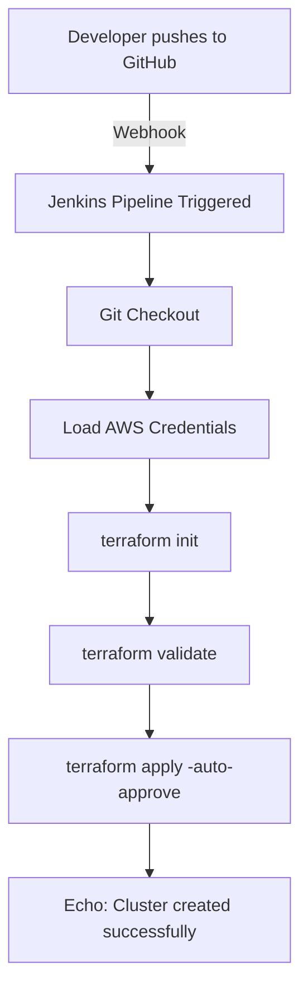
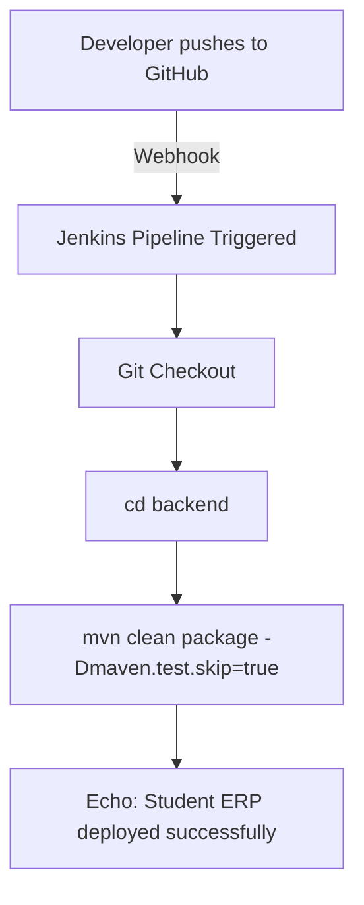
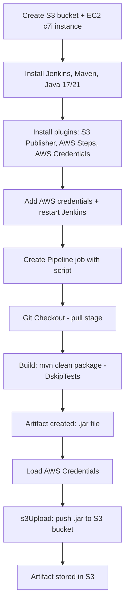

# 1) Jenkins + SonarQube Setup and Pipeline

This guide explains how to integrate **Jenkins** with **SonarQube** for code analysis using EC2 instances.

## 1. Create EC2 Instances
- **Instance 1:** Jenkins (instance type : t2.medium or more) 
- **Instance 2:** SonarQube  (instance type : t2.medium or more)

## 2. Setup Jenkins EC2 Server

### Install Java 17
```bash
sudo apt install openjdk-17-jdk -y
```

### Install Jenkins

Follow official Jenkins documentation:
👉 [Jenkins Installation Guide](https://www.jenkins.io/doc/book/installing/linux/)

### Install Maven
```bash
sudo apt install maven -y
```

## 3. Setup SonarQube EC2 Server
### Install Docker
```bash
sudo apt install docker.io -y
```
### Run SonarQube
```bash
docker run -d --name sonarqube-custom -p 9000:9000 sonarqube:10.6-community
```

## 4. Access Jenkins & SonarQube
- Jenkins: `http://<jenkins-public-ip>:8080`
- SonarQube: `http://<sonarqube-public-ip>:9000`
    - Login SonarQube with:
        - Username: `admin`
        - Password: `admin`
        - Change the default password after first login.


## 5. Configure SonarQube

1. Create Webhook
    - Go to: **Administration** → **Configuration** → **Webhooks** → **Create**
    - Name: `Sonar-webhook`
    - URL: `http://<jenkins-public-ip>:8080/sonarqube-webhook/`
2. Create a Project
    - Go to **Projects** → **Create Project** → **Local Project*
    - Project display Name: `studentapp`
    - Project key: `studentapp`
    - Main branch name: `main` then click **Next**
    - Select **Use global settings**
    - Generate **token** → **Copy** & save it
    - Select **Maven** as build tool → Copy the given command

## 6. Configure Jenkins
### 1. Install Plugin
  - Dashboard → Manage Jenkins → Plugins → Available Plugins
  - Install: **SonarQube Scanner for Jenkins**
### 2. Add Credentials
  - Dashboard → Manage Jenkins → Credentials → Global credentials (unrestricted)
  - Add new credential:
      - Kind: `Secret Text`
      - Secret: `<SonarQube Token>`
      - ID: `sonar-token`
### 3. Configure SonarQube Server
  - Dashboard → Manage Jenkins → System
  - Find SonarQube Server section
  - Enable environment variable
  - Add new SonarQube:
      - Name: `Sonar-env`
      - Server URL: `http://<sonarqube-public-ip>:9000`
      - Authentication Token: `sonar-token`
  - Save changes
**Note (optional)**: After configuring, restart the Jenkins server to ensure it operates smoothly. (http://<jenkins-public-ip>:8080/restart)

### Update the pom.xml with sonarqube dependancy

## 7. Create Jenkins Pipeline
1. Go to Dashboard → New Item → Pipeline
2. Paste the following pipeline code:
```jdp
pipeline {
    agent any
    stages {
        stage('pull') {
            steps {
                git branch: 'main', url: 'https://github.com/Rohit-1920/EasyCRUD-Updated.git'
            }
        }
        stage('build') {
            steps {
                sh '''cd backend
                    mvn clean package -DskipTests'''
            }
        }
        stage('test') {
            steps {
                withSonarQubeEnv(credentialsId: 'sonar-token', installationName: 'Sonar-env'){
                    sh '''cd backend
                        mvn org.sonarsource.scanner.maven:sonar-maven-plugin:sonar \\
                        -Dsonar.projectKey=studentapp \\
                        -Dsonar.projectName=studentapp'''
                }
            }
        }
        
        stage('Quality Gate') {
            steps {
                timeout(time: 10, unit: 'MINUTES') {
                    waitForQualityGate abortPipeline: true, credentialsId: 'sonar-token'
                }
            }
        }
    }
}
```

## 8. Run the Pipeline
- Build the job in Jenkins.
- Check results in SonarQube Dashboard.

## ✅ Summary
- Jenkins → CI/CD automation
- SonarQube → Code quality & security analysis
- Integration ensures code passes quality checks before deployment.


--------------------------------------------------------------------------------------------------------------------------------------
# 2) ⚙️ Jenkins Pipeline Projects

Two Jenkins pipeline setups documented step-by-step:
1. 🏗️ Create a cluster using **Terraform**
2. 🎓 Host **Student ERP** application

---

## 🏗️ How to Create a Cluster in Jenkins Using Terraform

### Step 1 — Prepare the EC2 instance
- Launch an **EC2 instance** (type: `c7i`)
- Install the following tools on it:
  - ✅ AWS CLI
  - ✅ Terraform
  - ✅ Jenkins
- Run `aws configure` to connect AWS CLI with your AWS account

### Step 2 — Configure Jenkins for AWS access
- Log in to **Jenkins**
- Go to **Manage Jenkins → Plugins → Available Plugins**
- Search for **AWS Credentials** plugin → Install it
- Go to **Manage Jenkins → Credentials**
- Add a new credential → Type: **AWS Access Key** → enter your **Access Key ID** and **Secret Access Key**

### Step 3 — Connect GitHub repo with Webhook
- Go to your **GitHub repository → Settings → Webhooks → Add webhook**
- Payload URL:
  ```
  http://<jenkins-server-ip>:8080/github-webhook/
  ```
- Click **Add webhook** ✅

### Step 4 — Create the Jenkins Pipeline Job
- **New Item → Pipeline**
- Under **Build Triggers**, enable ✅ **GitHub hook trigger for GITScm polling**
- In the **Pipeline script** box, search Google for **"Jenkins Declarative Pipeline"** and paste the base template as a starting point

### Step 5 — Build the script using Pipeline Syntax generator
Click **Pipeline Syntax** (at the bottom of the job config page), and generate each block below one at a time — copy each result into your script:

| Order | Select in Pipeline Syntax | Purpose |
|-------|---------------------------|---------|
| 1 | `git` | Clone the repository — fill in repo URL + branch |
| 2 | `withCredentials` | Securely load your AWS credentials into the pipeline |
| 3 | `sh` (shell) | Run: `terraform init` |
| 4 | `sh` (shell) | Run: `terraform validate` |
| 5 | `sh` (shell) | Run: `terraform apply -auto-approve` |
| 6 | `sh` (shell) | Run: `echo "Cluster created successfully"` |

### Step 6 — Save and Build
- Click **Save**
- Click **Build Now** 🚀

### 🖼️ Pipeline Flow



---

## 🎓 How to Host Student ERP on Jenkins

### Step 1 — Create the Jenkins Pipeline Job
- **New Item → Pipeline**
- Under **Build Triggers**, enable ✅ **GitHub hook trigger for GITScm polling**
- Search Google for **"Jenkins Declarative Pipeline"** and paste the base template into the script box

### Step 2 — Build the script using Pipeline Syntax generator
Click **Pipeline Syntax**, generate each block, and copy the result into your script:

| Order | Select in Pipeline Syntax | Purpose |
|-------|---------------------------|---------|
| 1 | `git` | Clone the repository — fill in repo URL + branch |
| 2 | `sh` (shell) | Move into backend folder and build: `cd backend` then `mvn clean package -Dmaven.test.skip=true` |
| 3 | `sh` (shell) | Run: `echo "Student ERP deployed successfully"` |

### Step 3 — Save and Build
- Click **Save**
- Click **Build Now** 🚀

### 🖼️ Pipeline Flow



---

## 📌 Notes

- Both pipelines are triggered automatically via a **GitHub webhook** whenever code is pushed
- The **Pipeline Syntax generator** in Jenkins is used to auto-generate correct script blocks instead of writing them manually — reduces syntax errors
- `withCredentials` is used specifically when secrets (like AWS keys) are needed inside the pipeline — it keeps them out of plain text
- **Build Now** can always be used to manually re-trigger a pipeline, in addition to the webhook auto-trigger

----------------------------------------------------------------------------------------------------------------------------------------------

# 3) 📦 Copy Artifact File to S3 Using Jenkins

### 💡 What is an Artifact?

An artifact is a **snapshot of a build code** — a packaged, ready-to-run build. Once created, you don't need to rebuild the app again; the same artifact can be deployed to any other server directly.

**or**

An artifact is a packaged, ready-to-run build of your application. Once created, you don't need to rebuild the app again — the same artifact can be deployed to any other server directly.

---

### 🧩 Required Plugins
- ✅ **S3 Publisher**
- ✅ **Pipeline: AWS Steps**
- ✅ **AWS Credentials**

---

### 🔧 Setup Steps

**Step 1 — Prepare infrastructure**
- Create an **S3 bucket**
- Launch an **EC2 instance** (type: `c7i`)
- Install on the instance:
  - ✅ Jenkins
  - ✅ Maven
  - ✅ Java (versions **17** and **21**)

**Step 2 — Install & configure Jenkins plugins**
- Go to **Manage Jenkins → Plugins → Available Plugins**
- Install:
  - **S3 Publisher**
  - **Pipeline: AWS Steps**
  - **AWS Credentials**
- Go to **Manage Jenkins → Credentials** → add your AWS Access Key + Secret Key
- **Restart Jenkins** so the plugins load correctly

**Step 3 — Create the pipeline job**
- New Item → **Pipeline**
- In the **Pipeline script** box, paste the script below
- ⚠️ Update:
  - `bucket` → your actual S3 bucket name
  - `credentialsId` → the exact name you gave your credentials in Jenkins

```groovy
pipeline {
    agent any
    stages {
        stage('pull') {
            steps {
                git branch: 'main', url: 'https://github.com/Rohit-1920/EasyCRUD-Updated.git'
            }
        }
        stage('build') {
            steps {
                sh '''cd backend
                mvn clean package -DskipTests'''
            }
        }
        stage('s3Upload') {
            steps {
                withCredentials([aws(accessKeyVariable: 'AWS_ACCESS_KEY_ID', credentialsId: 'aws-cred', secretKeyVariable: 'AWS_SECRET_ACCESS_KEY')]) {
                    s3Upload acl: 'Private', bucket: 'jenkins-artifact-manager123', file: 'backend/target/student-registration-backend-0.0.1-SNAPSHOT.jar', path: ''
                }
            }
        }
    }
}
```

**Step 4 — Build**
- Click **Save**
- Click **Build Now** 🚀

---

### 🖼️ Pipeline Flow



---

### 📌 Quick Notes
- `acl` controls who can access the file in S3 (`Private` / `PublicRead`, etc.)
- `bucket` is the target S3 bucket name — must already exist
- `file` is the local path (in the Jenkins workspace) to the artifact being uploaded
- `path` is the destination folder/prefix inside the S3 bucket — leave `''` to upload to the bucket root
- `withCredentials` keeps AWS keys secure and out of plain text in the script
- Restarting Jenkins after installing plugins ensures they're properly loaded before use


# 4) EasyCRUD Dockerized Project With CI/CD

This project demonstrates a complete CI/CD pipeline using **Jenkins**, **Docker**, **MariaDB**, and **AWS EC2** to build, push, and deploy frontend and backend applications.

---

## 🚀 Project Overview

- Frontend and Backend built with Docker  
- Database: MariaDB  
- CI/CD Pipeline managed by Jenkins  
- Images pushed to Docker Hub  
- Deployment on AWS EC2 Instance  

---

## ✅ Prerequisites

- AWS EC2 instance (example IP: `35.154.244.253`)  
- Open port `3306` for MariaDB in EC2 Security Group  
- Docker Hub account  
- Jenkins installed on EC2  

---

## ⚡ Installation Steps

### 1️⃣ Install Java
```bash
sudo apt update
sudo apt install openjdk-17-jdk
java -version
```

### 2️⃣ Install Jenkins
```bash
sudo wget -O /etc/apt/keyrings/jenkins-keyring.asc \
  https://pkg.jenkins.io/debian-stable/jenkins.io-2023.key
echo "deb [signed-by=/etc/apt/keyrings/jenkins-keyring.asc]" \
  https://pkg.jenkins.io/debian-stable binary/ | sudo tee \
  /etc/apt/sources.list.d/jenkins.list > /dev/null
sudo apt-get update
sudo apt-get install jenkins
```
### Change Jenkins Default Port

1. Go to /lib/systemd/system/
2. Edit the jenkins.service
3. Replace port 8080 with 8081
4. Restart Jenkins service

### 3️⃣ Install Docker
```bash
sudo apt install docker.io -y
sudo usermod -aG docker jenkins
```

### 4️⃣ Grant Jenkins Sudo Privileges
```bash
sudo visudo
# Add the following line at the end of the file:
jenkins ALL=(ALL) NOPASSWD: ALL
```
---
### Restart jenkins
---
### 5️⃣ Install MariaDB
```bash
sudo apt update
sudo apt install mariadb-server -y
sudo mysql_secure_installation
```

---

## ✅ Create Database and User

```sql
CREATE DATABASE student_db;
GRANT ALL PRIVILEGES ON student_db.* TO 'root'@'%' IDENTIFIED BY 'redhat';
FLUSH PRIVILEGES;
```

---

## ✅ Application Configuration

### `application.properties`
```properties
server.port=8081
spring.datasource.url=jdbc:mysql://35.154.244.253:3306/student_db
spring.datasource.username=root
spring.datasource.password=redhat
spring.jpa.hibernate.ddl-auto=update
spring.jpa.show-sql=true
spring.jpa.properties.hibernate.dialect=org.hibernate.dialect.MariaDBDialect
```

### `.env`
```bash
VITE_API_URL="http://35.154.244.253:8081/api"
```

---

## ✅ Docker Cleanup Command

```bash
docker kill $(docker ps -q) && docker rm -v $(docker ps -a -q) && docker rmi $(docker images -q)
```

---

## ✅ Store DockerHub Credentials in Jenkins

1. Go to Jenkins Dashboard → Manage Jenkins → Manage Credentials  
2. Select domain: `(global)`  
3. Add Credentials:  
    - **Username:** `<dockerhub-username>`  
    - **Password:** `<dockerhub-password>`  
    - **ID:** `dockerhub-cred`  

---

## Pipeline changes

1. Add your GitHub Repo URL
2. Add your Docker hub repo in the Image build section
3. Create your own docker credentionals - Jenkins --> Manage Jenkins --> Credentials --> Username and password
4. Call the credentials using withCredentials using username and password seperated

## ✅ Jenkins Pipeline Overview

```groovy
pipeline {
    agent any

    stages {
        stage('Clone Repo') {
            steps {
                git url: "https://github.com/dev-vinay18/EasyCRUD-Updated.git", branch: "main"
            }
        }

        stage('Build Frontend Image') {
            steps {
                sh "docker build -t vinayw123/easycrud2-jenkins:frontend ./frontend"
            }
        }

        stage('Build Backend Image') {
            steps {
                sh "docker build --no-cache -t vinayw123/easycrud2-jenkins:backend ./backend"
            }
        }

        stage('Docker Hub Login') {
            steps {
                withCredentials([usernamePassword(credentialsId: 'dockerhub-cred', passwordVariable: 'PASSWORD', usernameVariable: 'USERNAME')]) {
                    sh "echo $PASSWORD | docker login -u $USERNAME --password-stdin"
                }
            }
        }

        stage('Push Frontend Image to Docker Hub') {
            steps {
                sh "docker push vinayw123/easycrud2-jenkins:frontend"
            }
        }

        stage('Push Backend Image to Docker Hub') {
            steps {
                sh "docker push vinayw123/easycrud2-jenkins:backend"
            }
        }

        stage('Run Frontend Container') {
            steps {
                sh '''
                    docker rm -f easycrud1-frontend || true
                    docker run -d --name easycrud1-frontend -p 80:80 vinayw123/easycrud2-jenkins:frontend
                '''
            }
        }

        stage('Run Backend Container') {
            steps {
                sh '''
                    docker rm -f easycrud1-backend || true
                    docker run -d --name easycrud1-backend -p 8080:8080 vinayw123/easycrud2-jenkins:backend
                '''
            }
        }
    }
}
```

---

## ✅ Notes

- Ensure EC2 Security Group allows these ports:  
    - `3306` (MariaDB)  
    - `80` (Frontend)  
    - `8081` (Backend)  

- Store DockerHub credentials in Jenkins for secure pipeline execution.

---
