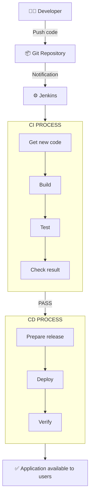

# 🔧 Jenkins Notes

Simple notes on **what Jenkins is**, **how its workflow works**, and **what each part is used for**.

---

## ❓ What is Jenkins?

Jenkins is an **open-source automation server** used to build, test, and deploy code automatically.

This process is called **CI/CD**:
- 🔄 **CI (Continuous Integration)** → automatically build & test code every time it's pushed
- 🚀 **CD (Continuous Deployment/Delivery)** → automatically release that tested code to a server/cloud

👉 In short: **Jenkins removes manual work** — no need to build, test, or deploy by hand every time. It does it the same way, every time, automatically.

---

## 🖼️ Jenkins Workflow Diagram



<details>
<summary>📋 Text version (if the diagram above doesn't render)</summary>

```
👨‍💻 Developer
     │
     │  Push code
     ▼
📦 Git Repository
     │
     │  Notification
     ▼
⚙️  Jenkins
     │
     ▼
┌──────────────────┐
│   CI PROCESS     │
│                  │
│  Get new code    │
│       ↓          │
│  Build           │
│       ↓          │
│  Test            │
│       ↓          │
│  Check result    │
└────────┬─────────┘
         │
       PASS
         │
         ▼
┌──────────────────┐
│   CD PROCESS     │
│                  │
│  Prepare release │
│       ↓          │
│  Deploy          │
│       ↓          │
│  Verify          │
└────────┬─────────┘
         │
         ▼
    ✅ Application
    available to users
```

</details>

---

## 📝 Step-by-Step Workflow Explained

| Step | What happens | Where it happens |
|------|--------------|-------------------|
| 1️⃣ | Developer writes code and pushes it | **Local machine → Git repo** |
| 2️⃣ | Git repo sends a **webhook** signal | **GitHub/GitLab → Jenkins server** |
| 3️⃣ | Jenkins picks up the trigger and reads the **Jenkinsfile** | **Jenkins server** |
| 4️⃣ | **Checkout stage** — pulls latest code from repo | **Jenkins agent / workspace** |
| 5️⃣ | **Build stage** — compiles code, installs dependencies, creates a build/image | **Jenkins agent (build server)** |
| 6️⃣ | **Test stage** — runs unit tests, integration tests | **Jenkins agent / test environment** |
| 7️⃣ | **Deploy stage** — pushes final build to server, cloud, or Kubernetes cluster | **Target environment (EC2 / K8s / Docker host)** |
| 8️⃣ | If a stage fails ❌ | Pipeline **stops immediately**, developer gets **alerted** (email/Slack) |
| 9️⃣ | If all stages pass ✅ | App is **live**, team gets a **success notification** |

---

## 🧩 Key Components — What's Used Where

| Component | What it is | Used for |
|-----------|-----------|----------|
| 🗂️ **Jenkinsfile** | A text file (Groovy syntax) stored in your repo | Defines the entire pipeline: stages, steps, conditions |
| 🖥️ **Jenkins Master/Server** | The main Jenkins instance | Orchestrates the pipeline, schedules jobs |
| 🤖 **Jenkins Agent/Node** | A worker machine (can be separate from master) | Actually executes the build/test/deploy steps |
| 🔌 **Plugins** | Add-ons (Git plugin, Docker plugin, Slack plugin, etc.) | Extend Jenkins to integrate with other tools |
| 🪝 **Webhook** | A notification sent from Git to Jenkins | Auto-triggers the pipeline on every push |
| 📦 **Artifact** | The build output (jar, docker image, zip, etc.) | Gets passed from Build stage → Deploy stage |
| 🔔 **Notifications** | Email / Slack / Teams alerts | Inform developers of success or failure |

---

## 💡 Key Takeaway

> Jenkins automates the full journey: **code pushed → built → tested → deployed** — reliably, the same way, every single time. That automation is the **"Continuous"** in CI/CD. 🔁
